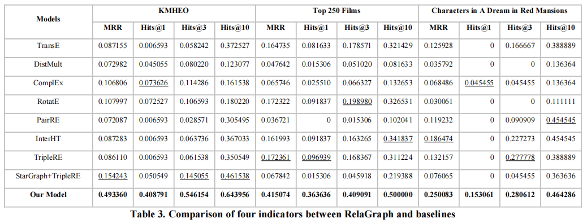

# RelaGraph
The code of "RelaGraph: Improving Embedding on Small-scale Sparse Knowledge Graphs by Neighborhood Relations" ([paper](https://doi.org/10.1016/j.ipm.2023.103447))

In this paper, we propose a new KGE method named RelaGraph, which works well on small-scale sparse knowledge graphs. RelaGraph is based on [StarGraph](https://arxiv.org/abs/2205.14209) and improves the process of subgraph generation and entity encoding in StarGraph. We extend the neighborhood information by aggregate the links between the target node and its neighbors. In addition, we also make some improvements to the loss function and other aspects to adapt the KGE model to small sparse data sets. We tested our method on 3 small sparse KGs, and achieved SOTA performance. The experimental results proves that RelaGraph nicely compensates for the poor performance of current KGE algorithms on small KGs, and the improvement demonstrates its great effectiveness of representation learning on small-scale knowledge graphs.  

  

## Datasets
In this paper, we conducted experiments on three small-scale sparse KGs in total, including:  
+ KMHEO (`./datasets/KMHEO`) is a KG of historical events constructed in the [pre-experimental stage](https://kns.cnki.net/kcms/detail/11.1762.g3.20201229.1835.008.html), which contains 8,713 triples with 6,767 entities and 230 relations after preprocessing.  
+ [Top 250 Films](http://www.openkg.cn/dataset/top250film) (`./datasets/T250Films`) comes from a Chinese open knowledge graph platform OpenKG, containing 1,701 triples with 1,061 entities and 5 relations.  
+ [Characters in A Dream in Red Mansions](http://www.openkg.cn/dataset/the-dream-of-the-red-chamber-main) (`./datasets/RedMansions`) also comes from OpenKG, containing 381 entities, 98 relations and 344 triples.  
+ You can also experiment on your own dataset after splitting it into training set, test set and validation set, and putting the files under the directory `./datasets/XXX/`.

## Running
1. Install the requirements from the `./requirements.txt`
2. Check the datasets. The training set, test set, and validation set should be named `train.txt`, `test.txt`, and `valid.txt`, respectively, and a line in each file represents a triple (h,r,t), split by '\t'.
3. Run the `./run.py` to train and evaluate the KGE model. You can change the hyperparameters if necessary.

## Hyperparameters
You may need to change the hyperparameters in `./run.py` for best performance. And here comes the expression of some important hyperparameters.  
+ _data\_name_: the name of your datasets. You should put your data under the directory `./datasets/data_name/`.  
+ _use\_RelaGraph_: whether to use RelaGraph when generating subgraphs and encoding entities.   
+ _negative\_sample\_size_: Number of negative samples sampled for each positive sample.  
+ _batch\_size_: The sample size contained in a batch.  
+ _max\_step_: Total training steps.  
+ _learning\_rate_: Preset learning rate.  
+ _warmup\_step_: Step of warm-up strategy. Half of the max\_step if set None.  
+ _anchor\_size_: The size of alternative anchor set.  
+ _sample\_anchors_: Number of anchors sampled from the alternative anchor set when generating a subgraph.  
+ _sample\_neighbors_: Number of neighbors sampled from the 1-hop neighbors when generating the subgraph.  
+ _max\_relation_: The maximum value of the number of relations between two nodes (just in case there are plural relations between two entities).  

## Reference  
+ [https://github.com/hzli-ucas/StarGraph](https://github.com/hzli-ucas/StarGraph)  
+ [http://www.openkg.cn/dataset/top250film](http://www.openkg.cn/dataset/top250film)  
+ [http://www.openkg.cn/dataset/the-dream-of-the-red-chamber-main](http://www.openkg.cn/dataset/the-dream-of-the-red-chamber-main)  

## Citation  
If you find this work useful, please consider citing the paper:  
```
@article{SHI2023103447, 
    author = {Bin Shi and Hao Wang and Yueyan Li and Sanhong Deng}, 
    title = {RelaGraph: Improving Embedding on Small-scale Sparse Knowledge Graphs by Neighborhood Relations}, 
    journal = {Information Processing & Management}, 
    volume = {60}, 
    number = {5},
    pages = {103447},
    year = {2023},
    issn = {0306-4573}, 
    doi = {https://doi.org/10.1016/j.ipm.2023.103447},
    url = {https://www.sciencedirect.com/science/article/pii/S030645732300184X},
    keywords = {Knowledge graph, Knowledge graph embedding, Deep learning, StarGraph}
}
```
